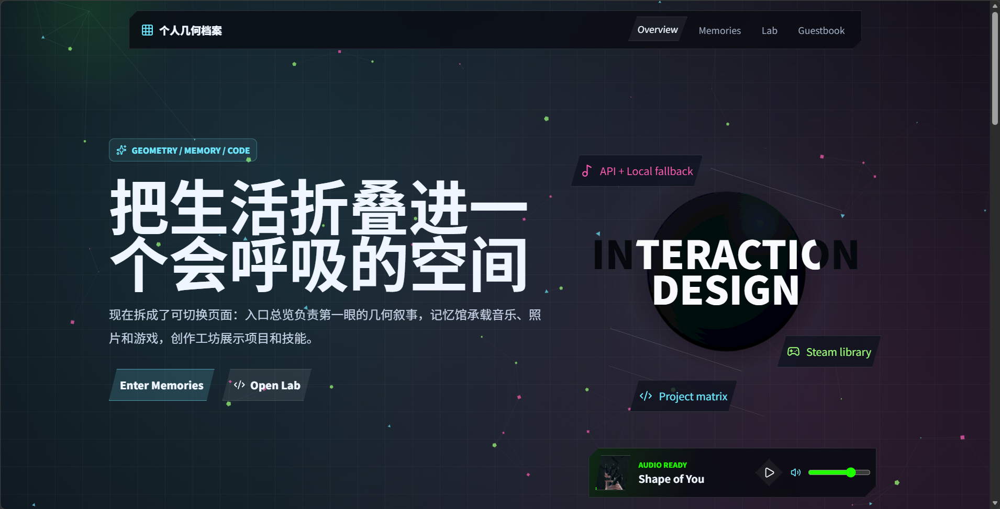

# MyWeb

MyWeb 是一个基于 React、Vite、TypeScript 构建的个人互动网页档案，后端使用轻量级的 Node.js + MySQL。该项目通过动态丰富的视觉界面展示回忆、照片、音乐、游戏、项目、技能和留言板信息。

前端可以独立运行，使用本地备用数据；后端则为本地开发和同局域网预览提供来自 MySQL 的真实数据。


## 功能特性

- 基于哈希导航的多页面个人网站
- 带有动画几何图形和页面过渡效果的互动首页
- 回忆页面，包含音乐播放、照片画廊和游戏档案
- 项目实验室页面，展示技能和精选项目卡片
- 基于 MySQL 的留言板页面，支持本地备用缓存
- MySQL 支持的内容 API，用于照片、游戏、项目、音乐曲目、技能和留言板条目
- 支持同局域网用户访问的局域网预览功能
- `src/data.ts` 中的静态备用数据，确保后端不可用时网站仍可正常渲染

## 技术栈

- 前端：React 19、TypeScript、Vite
- 动效和 UI：Framer Motion、Lucide React
- 后端：Node.js、Express
- 数据库：MySQL（通过 `mysql2` 连接）
- 环境配置：`dotenv`
- 开发代理：Vite `/api` 代理到本地后端

## 项目结构

```text
myWeb/
  public/                 静态资源、图片、音乐、图标
  src/                    React 前端
    components/           共享 UI 组件
    features/             页面区块和功能模块
    hooks/                数据和音乐钩子
    pages/                路由级页面组件
    services/             API 客户端辅助函数
    styles/               按区域划分的 CSS 模块
    data.ts               本地备用数据和共享内容类型
  server/                 Express 后端
    routes/               API 路由
    config.js             环境和 CORS 配置
    db.js                 MySQL 连接池
    index.js              API 服务器入口
    lan.js                局域网 IP 检测辅助工具
  database/
    init.sql              MySQL 数据库、表和种子数据
    README.md             数据库设置说明
```

## 环境要求

- Node.js 18 或更高版本
- npm
- 推荐使用 MySQL 8.x

## 安装

```bash
npm install
```

## 环境配置

将 `.env.example` 复制为 `.env`：

```bash
cp .env.example .env
```

在 Windows PowerShell 中：

```powershell
Copy-Item .env.example .env
```

然后更新 MySQL 相关字段：

```env
PORT=4000
CORS_ORIGIN=http://localhost:5173

MYSQL_HOST=127.0.0.1
MYSQL_PORT=3306
MYSQL_USER=root
MYSQL_PASSWORD=your_mysql_password
MYSQL_DATABASE=myweb
MYSQL_CONNECTION_LIMIT=10
```

请勿提交 `.env` 文件。它包含本地敏感信息，且已被 `.gitignore` 忽略。

## 数据库设置

登录 MySQL 并运行：

```sql
SOURCE database/init.sql;
```

或者将 `database/init.sql` 的内容复制到 MySQL 客户端中手动执行。

该脚本将创建：

- `myweb` 数据库
- `guestbook_entries`（留言板条目）
- `photos`（照片）
- `games`（游戏）
- `projects`（项目）
- `music_tracks`（音乐曲目）
- `skills`（技能）

同时会插入从原始前端备用数据复制的初始展示数据。

## 开发

启动后端：

```bash
npm run dev:server
```

启动前端：

```bash
npm run dev
```

打开：

```text
http://localhost:5173
```

在开发环境中，Vite 会将前端的 `/api/*` 请求代理到：

```text
http://localhost:4000
```

## 局域网预览

如需同局域网用户访问，请先启动后端：

```bash
npm run dev:server
```

然后以局域网模式启动前端：

```bash
npm run dev:lan
```

Vite 将打印一个类似如下的网络地址：

```text
http://服务端IP地址:5173
```

如果其他用户无法打开网站，请检查：

- 前端是否使用 `npm run dev:lan` 运行
- 后端是否使用 `npm run dev:server` 运行
- Windows 防火墙是否允许 `5173` 和 `4000` 端口的入站 TCP 流量
- 所有用户是否连接到同一局域网
- 浏览器是否使用 `http://` 而非 `https://`

## API 接口

健康检查：

```text
GET /api/health
```

内容：

```text
GET /api/content
GET /api/content/photos
GET /api/content/games
GET /api/content/projects
GET /api/content/music-tracks
GET /api/content/skills
```

留言板：

```text
GET  /api/guestbook
POST /api/guestbook
```

留言板请求示例：

```bash
curl -X POST http://localhost:4000/api/guestbook \
  -H "Content-Type: application/json" \
  -d "{\"name\":\"访客\",\"message\":\"来自 MyWeb 的问候\",\"tone\":\"like\"}"
```

允许的留言板语气：

```text
idea（想法）
like（喜欢）
bug（问题）
```

## 数据流

应用首先尝试从以下地址加载真实数据：

```text
GET /api/content
```

如果后端不可用，前端将回退到 `src/data.ts`。

留言板消息从以下地址加载：

```text
GET /api/guestbook
```

当用户提交留言板消息时，前端会发送：

```text
POST /api/guestbook
```

如果提交失败，页面会将消息存储在浏览器本地存储中作为开发备用方案。

## 构建

```bash
npm run build
```

本地预览生产构建：

```bash
npm run preview
```

## 部署说明

前端可以作为静态 Vite 应用部署到 Vercel，但当前的 Express 后端和本地 MySQL 数据库不会自动在 Vercel 上运行。

如需真正的在线部署，请使用以下方法之一：

- 将 Express 后端部署到服务器或后端平台，并使用可云端访问的 MySQL 数据库
- 将 API 转换为 Vercel 无服务器函数，并连接到云 MySQL 数据库
- 将当前的本地后端仅用于本地开发或同局域网预览

如果前端和后端分开部署，请设置：

```env
VITE_API_BASE=https://your-backend-domain
```

后端还必须在 CORS 中允许前端域名。

## 脚本命令

```text
npm run dev          在本地主机上启动 Vite 前端
npm run dev:lan      以局域网访问模式启动 Vite 前端
npm run dev:server   以监视模式启动 Express 后端
npm run build        类型检查并构建前端
npm run preview      预览生产前端构建
npm run start:server 不以监视模式启动 Express 后端
```

## 注意事项

- 项目在 `public/assets` 下包含本地媒体资源
- `src/data.ts` 作为备用数据和共享类型定义仍然很重要
- `database/init.sql` 对大多数种子数据可以安全地多次运行，因为它使用了主键和重复时更新模式
- 同局域网访问取决于本地网络策略。某些校园或公共网络可能会隔离设备，即使它们看起来在同一局域网上
